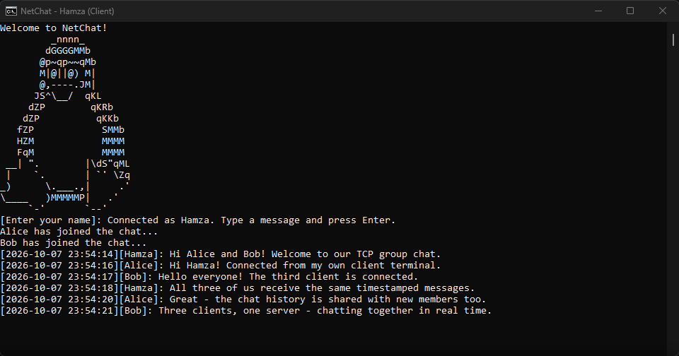

# NetChat: Concurrent TCP Chat Server

A terminal group chat server with a companion command-line client, written in Go.
Exchange timestamped messages using the included client with no extra installs.
The project grew from a Netcat-inspired networking assignment and also remains
compatible with external line-oriented TCP clients.

## Screenshot



Hamza's client terminal displaying timestamped messages from a three-person group chat.

## Quick start with the built-in Go client

You only need Go. Open three terminals in the `net-chat` repository directory
and run one command in each terminal:

| Terminal | Command | What to do next |
| --- | --- | --- |
| 1 — Server | `go run .` | Leave it running on port 8989. |
| 2 — First client | `go run ./cmd/client` | Enter `Alice`, then type messages. |
| 3 — Second client | `go run ./cmd/client` | Enter `Bob`, then type messages. |

Enter each name within 30 seconds. Press Enter to send a message and Ctrl+C to
close a client. If the server is already running on port 8989, start only the
clients. For custom ports and standalone binaries, see [Setup and usage](#setup-and-usage).

## Features

- Up to 10 simultaneous connections, including users entering their names.
- Required unique, case-sensitive names; blank and invalid names are rejected.
- Timestamped messages, join/leave notifications, and suppression of blank messages.
- Full in-memory message history replay for newly joined users.
- Independent client handlers and bounded output queues so slow readers do not
  block message delivery to other users.
- Connection cleanup on EOF, read errors, write failures, or queue overflow.
- Default port 8989, configurable port, and nonzero exit codes for startup errors.
- Built-in welcome banner that works regardless of the binary's working directory.
- Included Go client with concurrent keyboard input and message receiving.

## Setup and usage

Requires Go 1.22.2 or later. Ncat, Netcat, and Telnet are not required.
The server uses the Go standard library. The client uses Go's
[`golang.org/x/term`](https://pkg.go.dev/golang.org/x/term) package for terminal
editing, with `golang.org/x/sys` as an indirect dependency. Go downloads these
automatically on the first client run or build.

If you already have this repository open in a terminal, skip cloning it.

```sh
git clone https://github.com/ihamzaihsan/net-chat.git
cd net-chat
```

**Terminal 1: start the server.** Run this command by itself:

```sh
go run .
```

Wait for `NetChat is listening on port 8989`. Leave this terminal running:
the server waits for connections, so it does not return to the shell prompt.
Do not paste additional shell commands into this terminal while it is running.

**Terminal 2: connect the first client.** Open a new terminal in the repository
directory and run:

```sh
go run ./cmd/client
```

Enter `Alice` at the name prompt within 30 seconds.

**Terminal 3: connect the second client.** Open another terminal in the repository
directory and run:

```sh
go run ./cmd/client
```

Enter `Bob` when prompted. Send messages from either client terminal.
The server terminal displays startup and error diagnostics, not the chat interface.

If the connection is refused, check that the server is still running and the
client's port matches the number printed by the server. A client prints a
disconnect notice on a clean server closure, or an error on a network failure,
and exits. Invalid client arguments and network/input failures exit with status 1.

### Alternative startup methods

Choose one startup method at a time. To switch, stop the running server with
Ctrl+C first. For a custom port, run:

```sh
go run . 2525
```

Then run this command in each client terminal:

```sh
go run ./cmd/client 127.0.0.1:2525
```

The client accepts one optional `host:port` argument and defaults to
`127.0.0.1:8989`. For another computer, replace `127.0.0.1` with the server's
reachable IP address or hostname. IPv6 addresses require brackets, for example
`go run ./cmd/client "[::1]:8989"`.

Alternatively, build and run a standalone binary on Linux/macOS:

```sh
go build -o netchat .
go build -o netchat-client ./cmd/client
./netchat 8989
```

On Windows:

```sh
go build -o netchat.exe .
go build -o netchat-client.exe ./cmd/client
./netchat.exe 8989
```

Run `./netchat-client` (Windows: `./netchat-client.exe`) in each client terminal.
Once built, the binaries can run without Go installed.

The server accepts only one optional port argument. Ports must contain digits only and
be between 1024 and 65535. Invalid arguments print an error or
`[USAGE]: netchat [port]` to stderr and exit with status 1.

Enter a name when prompted, then type messages followed by Enter. For example,
when Alice sends `Hello!`, Bob sees:

```text
[2026-10-04 14:30:00][Alice]: Hello!
```

Timestamps use the server's local time when a message is received. The server
sends the same timestamped message to every client, including its sender. It
does not print timestamped input prompts or empty name entries between messages.
In supported interactive terminals, you see text while typing, then Enter
clears that input so only the server's confirmed timestamped message remains.
Incoming messages preserve your unfinished input. Close the client connection to leave and use
Ctrl+C in the server terminal to stop the server. Use Ctrl+C in a client terminal
to leave the chat. The client also sends a final input line on stdin EOF and
closes its TCP write side before waiting for the server's remaining output.

The server listens on all network interfaces. To connect from another computer,
use the server's reachable IP address and allow its port through the firewall.

## Design and limits

Each admitted connection has a reader handler and a single writer goroutine.
A channel reserves the 10 connection slots before name entry. A mutex protects
active membership and message history; name checking and registration happen
atomically. History replay is queued before subsequent live messages under that
same lock. Socket writes run in client writers rather than under the shared lock.

The companion client lives in `cmd/client/main.go`. It connects with a 5-second
timeout, sends complete input lines with a 5-second write deadline, and copies
incoming bytes directly to stdout so prompts without line endings appear promptly.
Keyboard input and receiving run concurrently. Interactive terminals use raw
input and a synchronized line editor with Backspace, arrow-key editing, and
wrapped-line handling. Enter clears the edited text without leaving an extra
line in the transcript. Ctrl+C or Ctrl+D on empty input exits; normal terminal
settings are restored on return. Resize detection updates the editor's dimensions.
Redirected input/output uses the plain streaming client without ANSI controls.
There is no automatic reconnection. Terminals that are not detected as interactive
use the plain mode and may still locally echo input.

- Names are trimmed, limited to 64 bytes, and cannot contain ASCII control
  characters or `[]:`. Name entry has a 30-second deadline, including retries.
- Message lines are limited to 4096 bytes, excluding the line ending. Oversized
  lines disconnect the client. Input uses one scanner throughout the connection
  so names and messages sent together retain their buffered data.
- Each client has a 64-item output queue and a 5-second deadline per write.
  A full queue or failed write closes that connection. Error diagnostics go to stderr.
- History contains chat messages only, remains in memory, and is lost on restart.
  It has no retention cap; memory use and replay size grow with the session.
- This is a learning and portfolio project for trusted networks. It has no TLS,
  authentication, persistent storage, multiple rooms, or graceful shutdown draining.

## Verification

```sh
gofmt -l main.go Server.go Functions.go cmd/client/main.go cmd/client/terminal.go
go vet ./...
go test ./...
go build ./...
```

Temporary regression checks were used during the portfolio review and removed
after verification. No automated test files are retained in this repository;
`go test ./...` therefore checks package compilation and reports no test files.

Verified on Windows with Go 1.27.1: build, vet, formatting, and seven temporary
regression checks with the race detector. These covered chat delivery/history,
connection admission and cleanup, concurrent name registration, slow readers,
input validation, name/write timeouts, and the maximum message size. CLI checks
also covered default/custom ports, invalid arguments, occupied ports, and running
the binary from another directory.

The included client also passed three temporary tests with race detection:
address validation, final input/reply handling on EOF, and server disconnection
while keyboard input is idle. Local subprocess checks covered three simultaneous
clients, duplicate-name retries, bidirectional messages, history replay, input
size limits, stdin EOF, server shutdown, and connection errors.

Terminal-editor regression checks passed with race detection for clearing short,
wrapped, and Unicode input; preserving drafts during incoming messages; CRLF
handling; name prompts; and plain piped input. Windows pseudo-terminal checks
also covered submission, wrapped lines, incoming messages during typing, and
Ctrl+C exit. Multi-computer operation and other operating systems were not tested.

## Authors

- Yousif Maidan (`ymaidan`)
- Hamza Cheema (`hcheema`)

